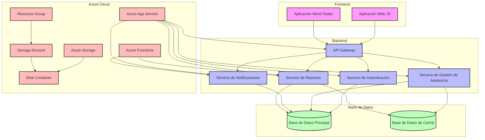
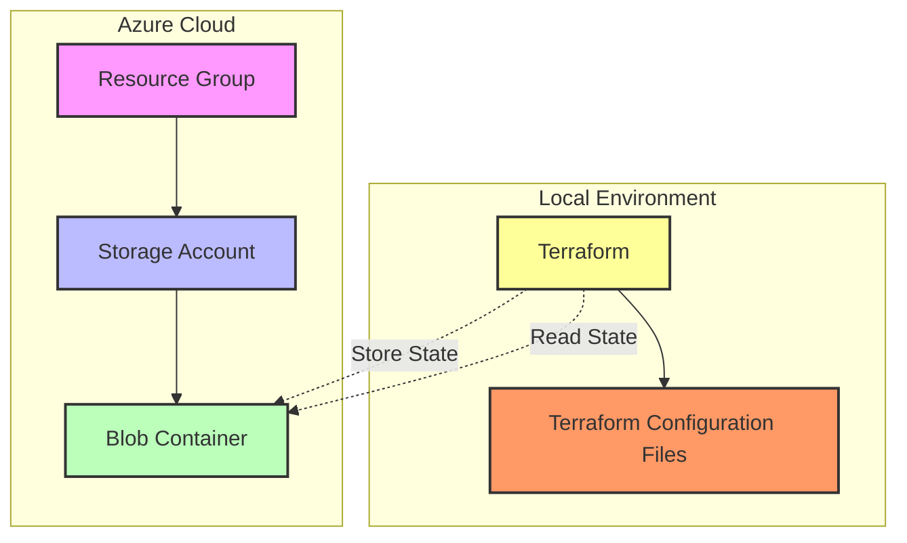
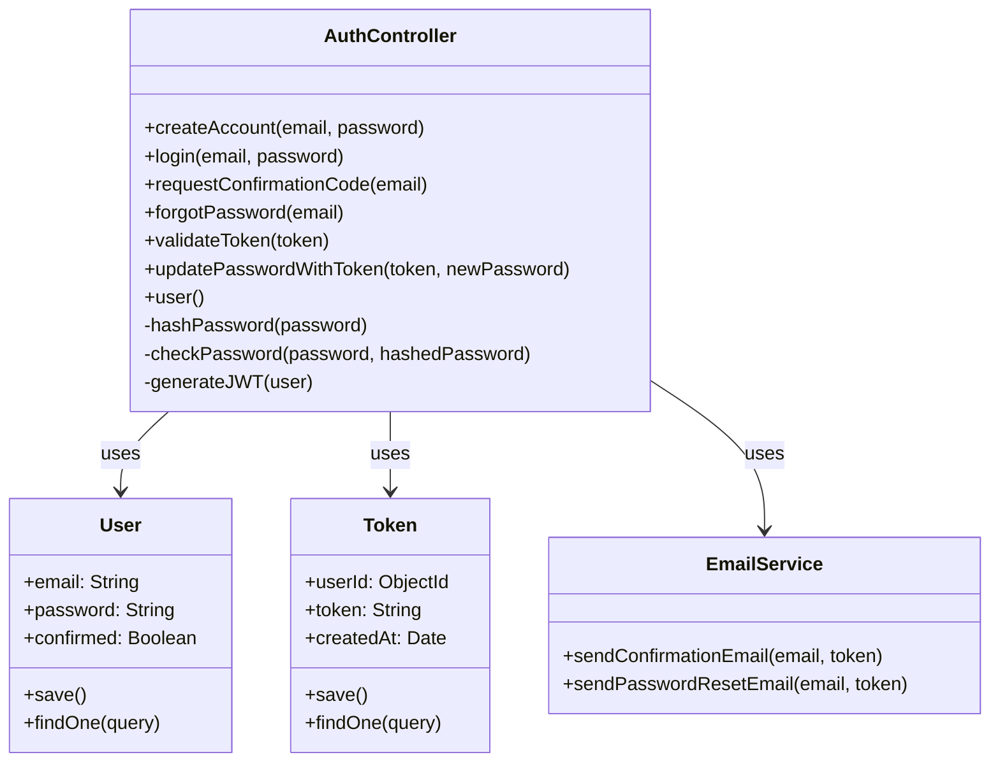
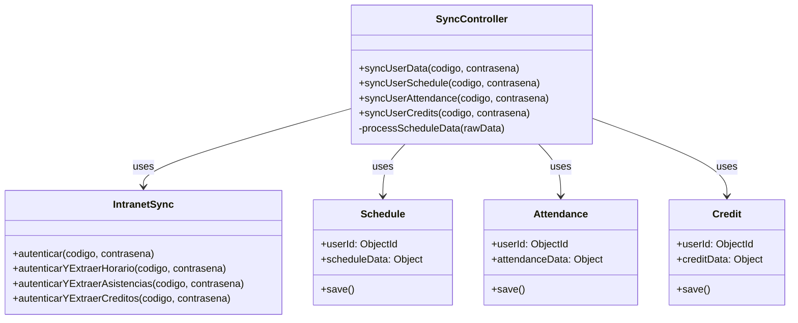
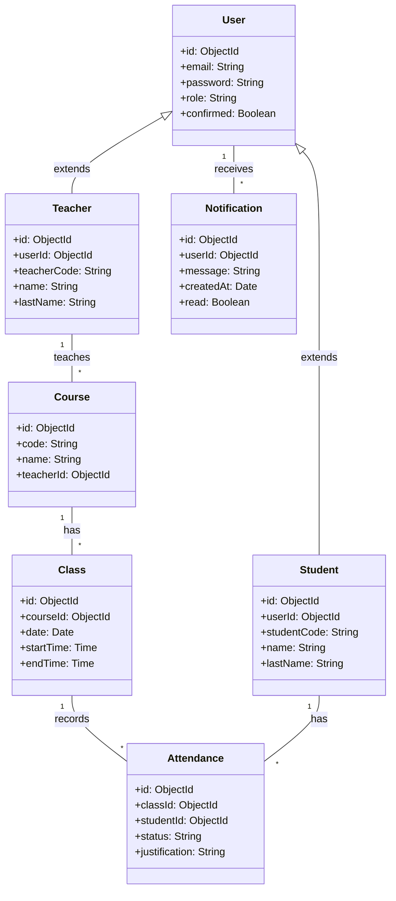

# Documentacion del proyecto "Desarrollo de una aplicación web y móvil para el control de asistencia de estudiantes"

## Requerimientos Funcionales y No Funcionales

### Requerimientos del Sistema

#### Requerimientos Funcionales

1. Rol de Docente:
   - RF1: Permitir a los docentes iniciar sesión de forma segura.
   - RF2: Permitir a los docentes registrar la asistencia de los estudiantes para cada clase.
   - RF3: Generar reportes de asistencia en forma de tablas y gráficos.
   - RF4: Permitir la visualización de tendencias de asistencia por estudiante, clase o período.
   - RF5: Permitir a los docentes modificar registros de asistencia pasados en caso de errores.
   - RF6: Proporcionar una función de búsqueda para encontrar rápidamente estudiantes o clases específicas.
   - RF7: Permitir la exportación de reportes de asistencia en formatos comunes (PDF, Excel).

2. Rol de estudiante:
   - RF8: Permitir a los estudiantes iniciar sesión de forma segura.
   - RF9: Mostrar el resumen de asistencia del estudiante para cada clase.
   - RF10: Enviar notificaciones push a los estudiantes sobre su cantidad de inasistencias.
   - RF11: Permitir a los estudiantes ver un calendario con sus días de asistencia e inasistencia.
   - RF12: Proporcionar una función para que los estudiantes puedan justificar sus inasistencias.

3. Backend:
   - RF13: Implementar una API RESTful para la comunicación entre el frontend y el backend.
   - RF14: Gestionar la autenticación y autorización de usuarios (docentes y estudiantes).
   - RF15: Procesar y almacenar los datos de asistencia en tiempo real.
   - RF16: Generar y enviar notificaciones automáticas basadas en reglas predefinidas.
   - RF17: Proporcionar endpoints para la generación de reportes y análisis de datos.

#### Requerimientos No Funcionales

1. Rendimiento:
   - RNF1: El sistema debe ser capaz de manejar al menos 1000 usuarios concurrentes sin degradación significativa del rendimiento.
   - RNF2: El tiempo de respuesta para las operaciones comunes (como registro de asistencia o consulta) debe ser inferior a 2 segundos.

2. Seguridad:
   - RNF3: Todas las comunicaciones deben estar encriptadas utilizando HTTPS.
   - RNF4: Las contraseñas de los usuarios deben almacenarse de forma segura utilizando algoritmos de hash modernos.
   - RNF5: El sistema debe implementar protección contra ataques comunes (SQL injection, XSS, CSRF).

3. Disponibilidad:
   - RNF6: El sistema debe estar disponible al menos el 99.9% del tiempo (menos de 9 horas de inactividad al año).

4. Escalabilidad:
   - RNF7: La arquitectura debe permitir escalar horizontalmente para manejar un aumento en la carga de usuarios.

5. Usabilidad:
   - RNF8: La interfaz de usuario debe ser intuitiva y requerir un mínimo de entrenamiento para su uso.
   - RNF9: La aplicación móvil debe ser compatible con las últimas versiones de iOS y Android.

6. Mantenibilidad:
   - RNF10: El código debe seguir las mejores prácticas de desarrollo y estar bien documentado.
   - RNF11: Deben implementarse pruebas automatizadas con una cobertura mínima del 80%.

7. Compatibilidad:
   - RNF12: La aplicación web debe ser compatible con las últimas versiones de los navegadores más comunes (Chrome, Firefox, Safari, Edge).

8. Cumplimiento:
   - RNF13: El sistema debe cumplir con las regulaciones de protección de datos aplicables (por ejemplo, GDPR si es aplicable).

9. Recuperación ante desastres:
   - RNF14: Debe implementarse un sistema de respaldo y recuperación que permita la restauración completa de los datos en menos de 4 horas.

10. Internacionalización:
    - RNF15: El sistema debe ser diseñado para soportar múltiples idiomas y formatos de fecha/hora.


## Plan de Proyecto: Sistema de Control de Asistencia de Estudiantes


### 1. Fase de Inicio

- Definir el alcance detallado del proyecto

- Identificar a los stakeholders

- Establecer el equipo del proyecto

- Crear la carta del proyecto

### 2. Fase de Planificación

- Desarrollar el plan de gestión del proyecto

- Crear el cronograma detallado

- Estimar el presupuesto

- Planificar la gestión de riesgos

- Definir los planes de comunicación y calidad

### 3. Fase de Diseño

- Realizar el análisis de requisitos detallado

- Diseñar la arquitectura del sistema

- Diseñar la base de datos

- Crear prototipos de la interfaz de usuario (web y móvil)

- Planificar la infraestructura en Azure

### 4. Fase de Desarrollo

- Configurar el entorno de desarrollo

- Desarrollar el backend (Node.js y Go)

- Desarrollar la aplicación web (JavaScript y JSON)

- Desarrollar la aplicación móvil (MAUI)

- Implementar la infraestructura en Azure usando Terraform

### 5. Fase de Pruebas

- Desarrollar plan de pruebas

- Realizar pruebas unitarias

- Realizar pruebas de integración

- Realizar pruebas de usuario

- Realizar pruebas de seguridad

- Corregir errores y optimizar el rendimiento

### 6. Fase de Implementación

- Preparar la documentación del usuario

- Realizar la capacitación de usuarios (docentes y estudiantes)

- Migrar datos existentes (si es necesario)

- Desplegar el sistema en producción

- Realizar pruebas finales en el entorno de producción

### 7. Fase de Cierre

- Obtener la aceptación formal del cliente

- Cerrar los contratos con proveedores

- Realizar una reunión de retrospectiva del proyecto

- Archivar la documentación del proyecto

- Celebrar el éxito del proyecto

### 8. Fase de Mantenimiento y Soporte

- Establecer procedimientos de soporte
  
- Monitorear el rendimiento del sistema
  
- Realizar actualizaciones y mantenimiento según sea necesario
  
- Recopilar feedback de los usuarios para futuras mejoras

### Consideraciones Adicionales

- Gestión continua de riesgos a lo largo del proyecto
  
- Reuniones regulares de seguimiento con el equipo y los stakeholders
  
- Actualización constante de la documentación del proyecto
  
- Asegurar el cumplimiento de las regulaciones legales sobre manejo de datos de estudiantes
  

## Historias de Usuario

### Docentes

#### HU-D01: Inicio de sesión
Como docente, quiero poder iniciar sesión en la aplicación web de forma segura, para acceder a las funcionalidades del sistema.

#### HU-D02: Generación de reportes
Como docente, quiero poder generar reportes de asistencia en forma de tablas y gráficos, para analizar las tendencias de asistencia.

#### HU-D03: Modificación de registros de asistencia
Como docente, quiero poder modificar registros de asistencia pasados, para corregir errores o actualizar información.

#### HU-D04: Visualización de tendencias
Como docente, quiero poder ver tendencias de asistencia por estudiante, clase o período, para identificar patrones y tomar decisiones informadas.

### Estudiantes

#### HU-E01: Inicio de sesión móvil
Como estudiante, quiero poder iniciar sesión en la aplicación móvil de forma segura, para acceder a mi información de asistencia.

#### HU-E02: Visualización de resumen de asistencia
Como estudiante, quiero poder ver un resumen de mi asistencia para cada clase, para estar al tanto de mi participación.

#### HU-E03: Notificaciones de inasistencias
Como estudiante, quiero recibir notificaciones sobre mi cantidad de inasistencias,
para estar al tanto de mi situación académica.

#### HU-E04: Visualización de calendario de asistencia
Como estudiante, quiero ver un calendario con mis días de asistencia e inasistencia, para tener una visión general de mi participación en clases.

#### HU-E05: Justificación de inasistencias
Como estudiante, quiero poder enviar justificaciones por mis inasistencias, para informar a mis docentes sobre las razones de mis ausencias.

## Diagrama Arquitectura Completo


## Diagrama de Arquitectura: Terraform con Backend Azure



Este diagrama muestra la configuración del backend remoto de Terraform en Azure. El Resource Group en Azure contiene una Storage Account, que a su vez alberga un Blob Container. Terraform, ejecutado en el entorno local, interactúa con este Blob Container para almacenar y leer el estado de la infraestructura.

## Diagramas de Clases del Backend

### Diagrama de Clases - Autenticación



### Diagrama de Clases - Sincronización


### Modelo de Datos

### Componentes Principales

1. **Frontend**
   - **Aplicación Web (JS)**: Interfaz para docentes desarrollada en JavaScript.
   - **Aplicación Móvil (Flutter)**: Aplicación para estudiantes desarrollada con Flutter.

2. **Backend**
   - **API Gateway**: Punto de entrada único para todas las solicitudes del cliente.
   - **Servicio de Autenticación**: Maneja la autenticación y autorización de usuarios.
   - **Servicio de Gestión de Asistencia**: Procesa y almacena los registros de asistencia.
   - **Servicio de Notificaciones**: Envía notificaciones a los estudiantes.
   - **Servicio de Reportes**: Genera reportes y análisis de asistencia.

3. **Base de Datos**
   - **Base de Datos Principal**: Almacena todos los datos del sistema.
   - **Base de Datos de Caché**: Mejora el rendimiento al almacenar datos frecuentemente accedidos.

4. **Servicios en la Nube (Azure)**
   - **Azure App Service**: Aloja las aplicaciones web y los servicios backend.
   - **Azure Functions**: Maneja tareas programadas y procesamiento en segundo plano.
   - **Azure Storage**: Almacena archivos y datos no estructurados.

# Documentación de la API

## Autenticación

### POST /api/v1/auth/login
Inicia sesión de un usuario.

**Request Body:**
```json
{
  "email": "string",
  "password": "string"
}
```

**Response:**
```json
{
  "token": "string",
  "user": {
    "id": "string",
    "email": "string",
    "role": "string"
  }
}
```

### POST /api/v1/auth/register
Registra un nuevo usuario.

**Request Body:**
```json
{
  "email": "string",
  "password": "string",
  "role": "string"
}
```

**Response:**
```json
{
  "message": "User registered successfully",
  "user": {
    "id": "string",
    "email": "string",
    "role": "string"
  }
}
```

## Asistencia

### POST /api/v1/attendance/record
Registra la asistencia de un estudiante.

**Request Body:**
```json
{
  "classId": "string",
  "studentId": "string",
  "status": "string"
}
```

**Response:**
```json
{
  "message": "Attendance recorded successfully",
  "attendance": {
    "id": "string",
    "classId": "string",
    "studentId": "string",
    "status": "string",
    "date": "string"
  }
}
```

### GET /api/v1/attendance/student/{studentId}
Obtiene el registro de asistencia de un estudiante.

**Response:**
```json
{
  "studentId": "string",
  "attendanceRecords": [
    {
      "id": "string",
      "classId": "string",
      "status": "string",
      "date": "string"
    }
  ]
}
```

## Reportes

### GET /api/v1/reports/course/{courseId}
Genera un reporte de asistencia para un curso.

**Response:**
```json
{
  "courseId": "string",
  "courseName": "string",
  "attendanceRate": "number",
  "studentRecords": [
    {
      "studentId": "string",
      "studentName": "string",
      "attendanceRate": "number"
    }
  ]
}
```

### Consideraciones de Seguridad

- Toda la comunicación entre componentes se realiza a través de HTTPS.
- Se implementa autenticación y autorización en todos los niveles del sistema.
- Los datos sensibles se encriptan en tránsito y en reposo.
- Se aplican prácticas de desarrollo seguro y se realizan auditorías de seguridad regulares.

### Escalabilidad y Rendimiento

- Los servicios backend están diseñados como microservicios, permitiendo escalarlos independientemente.
- Se utiliza una base de datos de caché para mejorar el rendimiento de las consultas frecuentes.
- Azure App Service y Azure Functions permiten el escalado automático basado en la demanda.

### Despliegue e Infraestructura

- Se utiliza Terraform para la gestión de la infraestructura como código.
- Los servicios se despliegan en contenedores Docker para garantizar la consistencia entre entornos.
- Se implementan pipelines de CI/CD para automatizar el proceso de despliegue y pruebas.

Esta arquitectura proporciona una base sólida para el sistema de control de asistencia, permitiendo flexibilidad, escalabilidad y mantenibilidad a largo plazo.

# Elaborado por: Cesar Fabian Chavez Linares
